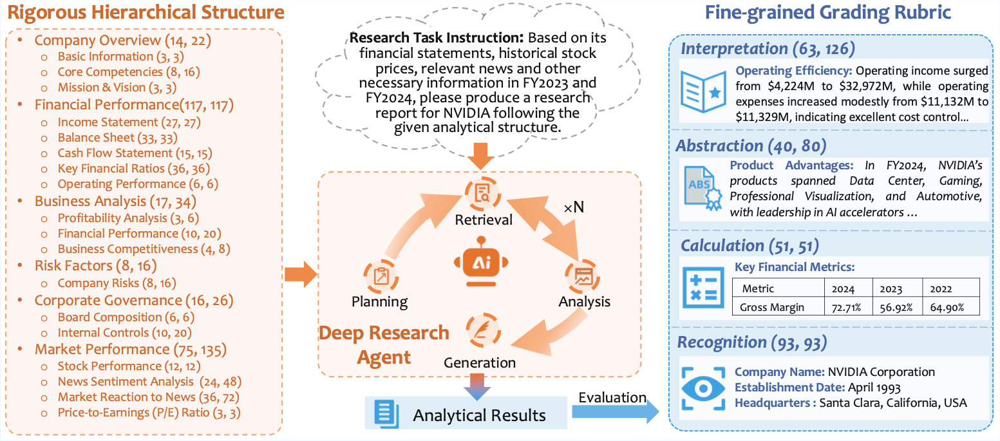

# Financial Deep Research (FinDeepResearch)

**Corporate financial analysis** is a critical process for understanding a listed company's business health, financial performance, and stock valuation, ultimately guiding investment decisions.
Professional analysts typically execute a comprehensive and rigorous workflow, beginning with the retrieval and recognition of relevant data from diverse sources, such as corporate disclosures, financial news, historical stock prices, and market indexes.
The data is then used for metric calculation, followed by strategic summarization and interpretation, aggregating in the generation of a research report to inform decision-making.
**FinDeepResearch** is specifically designed to emulate this professional pipeline to **conduct corporate financial analysis following an expert-designed analytical structure to generate a rigorous, structured report**.
Comprising **64 listed companies from 8 financial markets** and a total of **15,808 grading items**, FinDeepResearch provides a robust framework for evaluating the ability of advanced AI techniques (e.g., deep research agents) to generate corporate financial analysis reports that simultaneously adhere to a **systematic analytical structure (rigor)** and produce **specific, accurate claims (precision)**.

<p align="center">
  <a href="https://openfinarena.com/fin-deep-research"><b>📊 Benchmark Page</b></a> |
  <a href="https://www.arxiv.org/abs/2510.13936"><b>📑 Arxiv Paper</b></a> |
  <a href="https://huggingface.co/datasets/OpenFinArena/FinDeepResearch/blob/main/input_analytical_structure.csv"><b>🤗 Dataset</b></a>
</p>


## Task
The task aims to generate a comprehensive research report for a listed company by adhering to an expert-designed analytical framework and synthesizing heterogeneous financial data from diverse web sources, including corporate disclosures, financial news, stock prices, and market indices.

Formally, given a research task instruction `𝑖` with a desired analytical structure `S`, a method `M` is required to produce a research report `R` strictly following the analytical structure `𝑆`.

<div align="center">
<b>R = M (𝑖, 𝑆)</b>
</div>

<div align="center">
  
</div>

## Samples

| Market | Company Name | Input Analytical Structure | Sample Output Report |
|---|---|---|---|
| 🇺🇸 US | Nvidia | [test001.md](https://huggingface.co/datasets/OpenFinArena/FinDeepResearch/blob/main/Analytical%20Structure/test001.md) | [test001-report.md](https://huggingface.co/datasets/OpenFinArena/FinDeepResearch/blob/main/Sample%20Output%20Reports/test001-report.md) |
| 🇬🇧 UK | Shell PLC | [test012.md](https://huggingface.co/datasets/OpenFinArena/FinDeepResearch/blob/main/Analytical%20Structure/test012.md) | [test012-report.md](https://huggingface.co/datasets/OpenFinArena/FinDeepResearch/blob/main/Sample%20Output%20Reports/test012-report.md) |
| 🇨🇳 CN | 宁德时代新能源科技股份有限公司 | [test018.md](https://huggingface.co/datasets/OpenFinArena/FinDeepResearch/blob/main/Analytical%20Structure/test018.md) | [test018-report.md](https://huggingface.co/datasets/OpenFinArena/FinDeepResearch/blob/main/Sample%20Output%20Reports/test018-report.md) |
| 🇭🇰 HK | 腾讯 | [test025.md](https://huggingface.co/datasets/OpenFinArena/FinDeepResearch/blob/main/Analytical%20Structure/test025.md) | [test025-report.md](https://huggingface.co/datasets/OpenFinArena/FinDeepResearch/blob/main/Sample%20Output%20Reports/test025-report.md) |
| 🇸🇬 SG | Food Empire Holdings Ltd | [test039.md](https://huggingface.co/datasets/OpenFinArena/FinDeepResearch/blob/main/Analytical%20Structure/test039.md) | [test039-report.md](https://huggingface.co/datasets/OpenFinArena/FinDeepResearch/blob/main/Sample%20Output%20Reports/test039-report.md) |
| 🇦🇺 AU | CSL Ltd | [test043.md](https://huggingface.co/datasets/OpenFinArena/FinDeepResearch/blob/main/Analytical%20Structure/test043.md) | [test043-report.md](https://huggingface.co/datasets/OpenFinArena/FinDeepResearch/blob/main/Sample%20Output%20Reports/test043-report.md) |
| 🇲🇾 MY | IJM Corporation Berhad | [test051.md](https://huggingface.co/datasets/OpenFinArena/FinDeepResearch/blob/main/Analytical%20Structure/test051.md) | [test051-report.md](https://huggingface.co/datasets/OpenFinArena/FinDeepResearch/blob/main/Sample%20Output%20Reports/test051-report.md) |
| 🇮🇩 ID | PT Garudafood Putra Putri Jaya Tbk | [test061.md](https://huggingface.co/datasets/OpenFinArena/FinDeepResearch/blob/main/Analytical%20Structure/test061.md) | [test061-report.md](https://huggingface.co/datasets/OpenFinArena/FinDeepResearch/blob/main/Sample%20Output%20Reports/test061-report.md) |

## Dataset

**Selected companies:**
<ul>
    <li><strong>4 Languages:</strong> English, Simplified Chinese, Traditional Chinese and Indonesian Bahasa</li>
    <li><strong>8 Markets:</strong> United States (US), United Kingdom (UK), China (CN), Hong Kong (HK), Australia (AU), Singapore (SG), Malaysia (MY) and Indonesia (ID)</li>
    <li><strong>10 Industries (BICS):</strong> Communications, Consumer Discretionary, Consumer Staples, Energy, Health Care, Industrials, Materials, Real Estate, Technology, and Utilities</li>
    <li><strong>64 Companies:</strong> 8 companies from each market</li>
</ul>

The whole FinDeepResearch dataset for evaluation can be downloaded via the [🤗link](https://huggingface.co/datasets/OpenFinArena/FinDeepResearch/blob/main/input_analytical_structure.csv).

## Evaluation

### Env Preparation

```bash
conda create -n findeepresearch python=3.12
conda activate findeepresearch
pip install -r requirements.txt
```

Create a `.env` file in the project root and add your OpenAI API key:

```bash
OPENAI_API_KEY=your_openai_api_key_here
```

### How to Evaluate a Prediction

The evaluation process consists of 2 main steps
1. Context extraction:
   1. Extracts structured information from markdown files into a standardized JSON format that can be compared against ground truth data.
   2. Format score assessing section headers, subsection headers and markdown tables is given in the end.
2. Evaluation:
   1. Evaluates extracted predictions against ground truth data using different scoring methods based on question types.
   2. Content scores of 4 categories are given:
      - **Overall**: The final weighted score across all companies and question types
      - **Country-specific scores**: Individual scores for each market/location:
        - USA, UK, China, Hong Kong, Australia, Singapore, Malaysia, Indonesia
      - **Section-specific scores**: Individual scores for each section:
        - S1, S2, S3, S4, S5, S6
      - **Level-specific scores**: Individual scores for each level:
        - level1: Recognition
        - level2: Calculation
        - level3: Abstraction
        - level4: Interpretation

### Ground Truth

Ground truth files are **not provided** in this repository due to future competition constraints.

To run the evaluation script, place your own sample markdown files under:

```
data/ground_truth/findeepresearch_track/markdown/
```

Each file should correspond to a company in the dataset (e.g., `test001.md`). With sample files in place, the evaluation pipeline will be fully executable.

### Usage

```bash
PYTHONPATH='.' python evaluation/run.py \
    --track findeepresearch \
    --prediction_folder data/predictions/samples/markdown
```
**Parameters**:
- `--track`: `findocresearch` or `findeepresearch`
- `--prediction_folder`: Path to folder containing markdown prediction files. Each file should be the generated research report in markdown format following the analytical structure specified for that company, with the file name matching the input name exactly (e.g., `test001.md`).
- `--model`: llm model to use for extraction (default: `gpt-4.1`)
- `--extraction_only`: If to skip evaluation and only run extraction
- `--evaluation_only`: If to skip extraction and only run evaluation
- `--overwrite`: If to overwrite existing results

**Env Variables**:
- `TRACE_ENABLED`: Set to `true` to enable llm prompt and response persistence for debugging purpose
